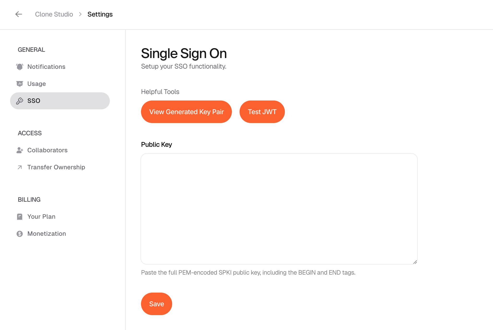
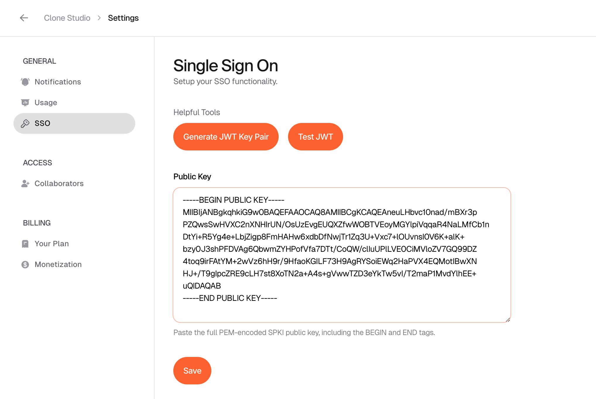
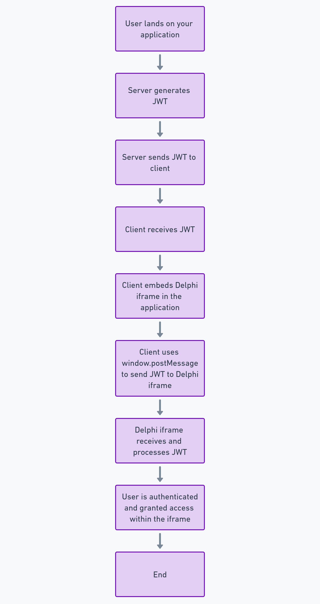

# Delphi SSO Guide

## Introduction

Single Sign-On (SSO) is an authentication method that allows users to access multiple applications with one set of credentials. Delphi's custom SSO implementation lets you streamlines user access to our website embed. This guide will walk you through setting up and using SSO with Delphi.

**Important:** The security of your SSO implementation relies heavily on keeping your private key confidential. Never share your private key or store it in unsecured locations.

## Getting Started

_This guide assumes you've already requested and been approved for SSO functionality. Contact [support@delphi.ai](mailto:support@delphi.ai) to begin the process._

### 1. Generate Your Key Pair

A pair of encryption keys, known as a key-pair, are used to make sure that your application and Delphi's API communicate securely by providing a way to verify that messages sent between one another are coming from a legitimate source.

Our first step is to generate those encryption keys. You have two options for generating your RSA key pair:

#### Option A: Using OpenSSL (Command Line)

Open your terminal and run the following commands:

```bash
openssl genrsa -out private_key.pem 2048
openssl rsa -in private_key.pem -pubout -out public_key.pem
```

This will generate a `private_key.pem` and a `public_key.pem` file in your current directory.

#### Option B: Using Delphi's Built-in Key Pair Generator

1. Navigate to the SSO settings in your Delphi dashboard.
2. Click on the "Generate Key Pair" button.
3. Follow the on-screen instructions to generate and download your key pair.




### 2. Configure Your SSO Settings

1. In Delphi's Clone Studio, go to the settings page, and find Single Sign-on (SSO) in the menu bar.
2. Paste your public key into the designated field and click Save.


### 3. Implement SSO in Your Application

To implement SSO in your application, you'll need to:

1. Generate a JWT (JSON Web Token) signed with your private key.
2. Send the JWT to the Delphi embed using the following JavaScript code:

Important Note: The only supported SSO field in the JWT payload is email. Any other fields in the JWT will be ignored, except for the standard expiry field. The only 
supported algorithim is RS256.

To authenticate the Delphi embedding in your app, you can run the following, providing the JWT you generated earlier:

```javascript
document.getElementById('delphi-frame').contentWindow.postMessage({
  type: 'sso_login',
  token: 'your_generated_jwt_here'
}, '*');
```

A sample SSO application is available in `sample-sso-app`. This demo showcases a basic implementation of the Delphi SSO flow and can serve as a reference for your own implementation.

### 4. Test Your SSO Implementation

Use Delphi's built-in JWT testing module to verify your token generation:

1. In Delphi's Clone Studio, go to the settings page, and find Single Sign-on (SSO) in the menu bar.
2. Navigate to the JWT testing section.
3. Paste a sample JWT generated by your system.
4. Click "Test JWT" to verify its validity and contents.


## Best Practices

1. **Protect Your Private Key:** Store your private key in a secure location, such as a secret management system. **Never expose it in client-side code** or public repositories. The security of your users depends upon it, and Delphi reserves the right to revoke your SSO approval should these keys be mishandled.

2. **Token Expiration:** Set appropriate expiration times for your JWTs to limit the window of opportunity for potential replay attacks. The sample app sets a JWT expiry of 1 hour. The longer the expiration date, the less secure it is.

By following these guidelines and best practices, you'll ensure a secure and efficient SSO implementation. 
