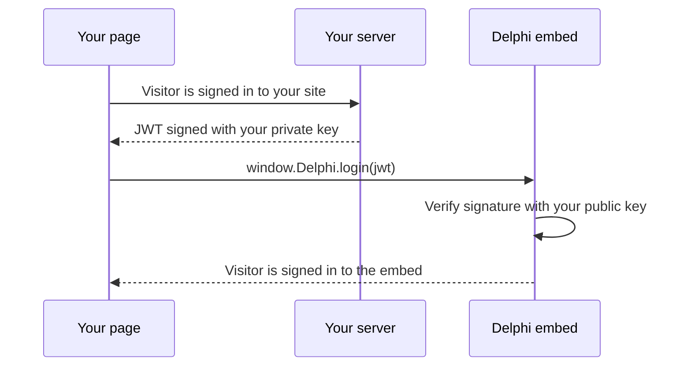

# Delphi Embed SSO

Embed SSO signs visitors into your Delphi embed as people your site, community,
or newsletter already knows. Their conversations follow them across devices, and
you see who they are in your inbox.

Each embed has its own SSO configuration. In Delphi, open **Integrations**, pick
the embed, and go to the **Identity** tab. If you don't see that tab, contact
[support@delphi.ai](mailto:support@delphi.ai) to enable SSO for your account.

There are three ways to sign visitors in:

| Mode                                     | Use it when                                  | Code on your page                                  |
| ---------------------------------------- | -------------------------------------------- | -------------------------------------------------- |
| [Custom JWT](#custom-jwt)                | Visitors sign in to your own site            | Your server signs a token; your page hands it over |
| [Mighty Networks](#mighty-networks)      | The embed lives on a Mighty Networks space   | None                                               |
| [Substack](#substack)                    | Your audience is your Substack subscribers   | None                                               |

In the API these are the `jwt_public_key`, `jwks`, and `oauth` verification
modes.

## Install the embed

Copy the snippet from the embed's **Configuration** tab. It looks like this:

```html
<script
  src="https://www.delphi.ai/embed.js"
  data-channel="YOUR_EMBED_ID"
  data-mode="inline"
  data-width="100%"
  data-height="600"
  async
></script>
```

Use `data-mode="bubble"` for the floating chat bubble. Older snippets that load
from `embed.delphi.ai` and configure `window.delphi = { ... }` keep working and
expose the same `window.Delphi` API described below.

## Custom JWT

Your server signs a short-lived RS256 JWT for the signed-in visitor. Your page
hands it to the embed. Delphi verifies the signature against the public key you
saved for that embed. The private key never leaves your server.


```mermaid
sequenceDiagram
  participant Browser as Your page
  participant Server as Your server
  participant Embed as Delphi embed
  Browser->>Server: Visitor is signed in to your site
  Server-->>Browser: JWT signed with your private key
  Browser->>Embed: window.Delphi.login(jwt)
  Embed->>Embed: Verify signature with your public key
  Embed-->>Browser: Visitor is signed in to the embed
```

### 1. Create a key pair

**Option A: generate it in Delphi.** On the Identity tab, choose **Custom JWT**,
turn on **Enable SSO**, and click **Generate Key Pair**. Delphi saves the public
key, turns SSO on, and downloads `delphi-embed-private-key.pem`. The private key
is generated in your browser and is never sent to Delphi, so store the download
somewhere safe right away.

**Option B: bring your own.**

```bash
openssl genpkey -algorithm RSA -pkeyopt rsa_keygen_bits:2048 -out private_key.pem
openssl pkey -in private_key.pem -pubout -out public_key.pem
```

Paste the contents of `public_key.pem` into **Public Key (PEM SPKI)**, including
the `BEGIN PUBLIC KEY` and `END PUBLIC KEY` lines, then click **Save
Configuration**.

### 2. Sign a token on your server

Only sign tokens for visitors you've already authenticated. The token must use
RS256.

| Claim   | Required    | Meaning                                                                                       |
| ------- | ----------- | --------------------------------------------------------------------------------------------- |
| `sub`   | Yes\*       | Stable, unique ID for the visitor in your system. The same `sub` is always the same visitor.  |
| `email` | No          | The visitor's email. If `sub` is missing, Delphi uses the email as the visitor ID.            |
| `name`  | No          | Display name shown in your inbox.                                                             |
| `exp`   | Recommended | Expiry. Keep it short; the sample uses one hour.                                              |
| `iss`   | No          | Checked only if you set **Issuer** on the Identity tab.                                       |
| `aud`   | No          | Checked only if you set **Audience** on the Identity tab.                                     |

\*A token without `sub` is accepted only if it has `email`.

If your tokens already use different claim names for the visitor ID or email,
set **Subject Claim** and **Email Claim** on the Identity tab instead of
changing your tokens. Emails with a `+` alias are rejected.

With [`jose`](https://github.com/panva/jose) in Node.js:

```ts
import { importPKCS8, SignJWT } from "jose";

const privateKey = await importPKCS8(process.env.DELPHI_PRIVATE_SSO_KEY!, "RS256");

const token = await new SignJWT({ email: user.email, name: user.name })
  .setProtectedHeader({ alg: "RS256" })
  .setSubject(user.id)
  .setIssuedAt()
  .setExpirationTime("1h")
  .sign(privateKey);
```

### 3. Hand the token to the embed

**With the `embed.js` snippet**, call the script's API:

```js
window.Delphi.login(token); // sign the visitor in
window.Delphi.logout(); // back to an anonymous visitor
```

The embed posts `{ type: "delphi:ready" }` to your page once it can accept a
sign-in. To sign visitors in as the page loads, wait for that message:

```js
window.addEventListener("message", (event) => {
  if (event.origin !== "https://www.delphi.ai") return;
  if (event.data?.type === "delphi:ready") window.Delphi.login(token);
});
```

`https://www.delphi.ai` is the origin of the `src` in your snippet. `delphi:ready` can fire again, for example when the visitor returns to the tab.
Calling `login` again with a token for the same visitor is safe.

**With a plain `<iframe>`** (no `embed.js`), post the token into the frame:

```js
const frame = document.getElementById("delphi-frame");
const delphiOrigin = "https://www.delphi.ai";

window.addEventListener("message", (event) => {
  if (event.source !== frame.contentWindow || event.origin !== delphiOrigin) return;
  if (event.data?.type === "delphi:ready") {
    frame.contentWindow.postMessage({ type: "sso_login", token }, delphiOrigin);
  }
});

// To sign out:
frame.contentWindow.postMessage({ type: "sso_logout" }, delphiOrigin);
```

The embed only accepts these messages from the page that embeds it. Always pass
the Delphi origin as the `targetOrigin`, never `"*"`.

### 4. Test your token

On the Identity tab, paste a token into **Test JWT** and click **Test JWT**. It
checks the signature against your saved public key and shows the subject, email,
and expiry it read. The check runs in your browser.

### Expired tokens

An expired token fails with `Invalid SSO token: token has expired.` Mint a fresh
token on each page load rather than caching one. Sending an expired token
doesn't sign out a visitor who is already signed in.

## Mighty Networks

Mighty Networks members who are signed in to your space are recognized
automatically. Mighty Networks posts a signed token into the embed, and Delphi
verifies it against Mighty Networks' published keys. There's nothing to install
beyond the embed snippet.

Delphi sets this mode up for your embed; contact
[support@delphi.ai](mailto:support@delphi.ai). Once it's set up, use **Enable
SSO** on the Identity tab to turn it on or off.

## Substack

Paid subscribers sign in with Substack from inside the embed. There's no code
on your page: the embed opens a Substack sign-in popup, and Delphi signs the
visitor in when it closes.

1. In your Substack OAuth app, register this redirect URI exactly:

   ```
   https://delphi.ai/api/embed/oauth/substack/callback
   ```

2. On the Identity tab, choose **Substack** under **How visitors sign in**.
3. Enter your **Publication host** (for example `newsletter.substack.com` or your
   custom domain) and your **OAuth client ID**, then click **Save
   Configuration**.

Paid subscribers get subscriber access. Anyone else is sent to your
publication's subscribe page.

## Security

- Keep the private key on your server, in a secret manager. Never ship it to the
  browser or commit it. If it leaks, generate a new key pair; tokens signed with
  the old key stop working once you save the new public key.
- Keep `exp` short to limit replay.
- Use a `sub` that never changes and is never reused for a different person.

## Sample app

[`sample-sso-app`](sample-sso-app) is a Next.js app that installs the embed with
`embed.js`, signs a Custom JWT in a server action, and signs a demo visitor in
and out with `window.Delphi.login` and `window.Delphi.logout`. See its
[README](sample-sso-app/README.md) to run it.
